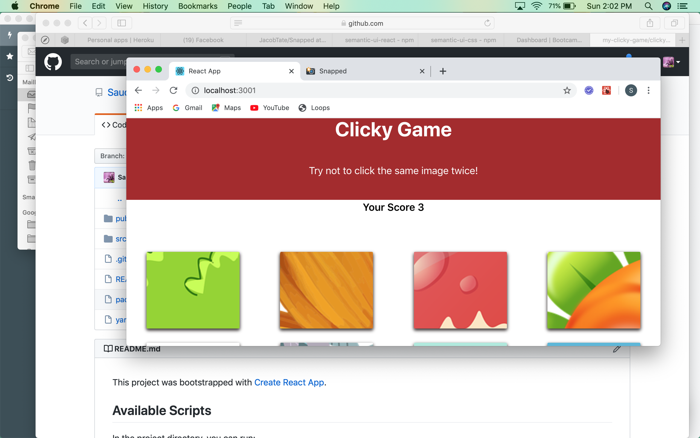

# my-clicky-game
A memory game that lets users click pictures randomly, while avoiding to click the same picture twice.
There are a total of 12 pictures in all. If a player is able to click each of the 12 pictures, it is a win, otherwise, it is a lost, and players are advised to click and start again.

# Technologies used
- React
- React Dom
- React Bootstrap

# Screenshot
